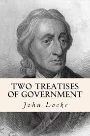

```{r setup, include = FALSE}
short = "true"
exclude_stepwise = "false"
exclude_extra = "false"

# cache everything 
knitr::opts_chunk$set(warning = FALSE, 
                      message = FALSE,
                      echo = FALSE, 
                      #fig.path = "Figs/",
                      fig.topcaption=TRUE,
                      cache = TRUE, 
                      fig.align = 'center',
                      fig.retina = 2,
                      fig.show="hold",
                      fig.pos= "htbp",
                      fig.path = "Figs/",
                      fig.cap = '   ',
                      out.width = "100%",
                      out.extra = "")


# Xaringan: https://slides.yihui.name/xaringan/
library("xaringan")
library("xaringanthemer")
library("here")
library("tidyverse")
library("magrittr")
library("knitr")
library("kableExtra")


style_mono_light(base_color = "#3b444b",
          link_color	
 = "#92d6b6",
          inverse_link_color	
 = "#B7E4CF",
          #background_image = "Figs/ej-superfund-light.jpeg",
          background_color = "#FFFFFF", #FAF0E6", # linen
          header_background_content_padding_top = "7rem",
 header_font_google = google_font("Open Sans"), 
          text_font_google = google_font("Open Sans"), 
 #text_font_family = "cm-web-fonts",
 #text_font_url = "https://cdn.jsdelivr.net/gh/aaaakshat/cm-web-fonts@latest/fonts.css",
          base_font_size = "30px",
  text_font_size = "1rem",
 code_font_size = "1rem",
 header_h1_font_size = "1.75rem",
  header_h2_font_size = "1.5rem",
  header_h3_font_size = "1.25rem",
          padding = "15px",
          code_font_google = google_font("Inconsolata"), 
          code_inline_background_color    = "#FFFFFF", 
          #table_row_even_background_color = "grey"#, extra_css = list(".remark-slide-number" = list("display" = "none"))
 )
```


# Today's Objectives

1. Review and further explore the aims of civil liberties protections for individuals (especially minorities) from majorities.

2. Understand what makes freedom of speech a classic civil liberty.

4. Understand the partial and conditional nature of property as a constitutional civil liberty in the United States.

5. Understand the role of the legislative, executive, and judicial branches of government in creating, defining, and protecting speech and property rights.

---

# Agenda 

Mini-lecture: Constitutional civil liberties

- What goals and values do civil liberties advance? 
- Who enforces civil liberties? 

Textbook review: Speech rights

Mini-lecture: Property rights

- How are property rights established by the 5th and 14th Amendments like and unlike the classic civil liberties of the 1st amendment, like freedoms of speech and the press? 

???

I want to cover two things that were not addressed in your textbook chapter on civil liberties. 

1) The textbook focused on the role of courts and court cases, but most government decisions never go

Why are courts particularly relevant to civil liberties? 


What is a CONSTITUTIONAL  civil liberty? 

- “restraint” 


---


# What are constitutional civil liberties? 

> “The very purpose of the Bill of Rights was to **withdraw certain subjects** from the vicissitudes of political controversy, to place them **beyond the reach of majorities** and officials and establish them as legal principles to be applied by the courts.” -*West Virginia State Board of Education v. Barnette*
 
--

## *Subjects beyond political controversy?!*

 
---
 
# What are constitutional civil liberties? 

## *Subjects beyond political controversy?!*

### The Bill of Rights places certain *questions of political rights* beyond the reach of majorities and officials.

> “designed to protect the rights of unpopular minorities” (p. 118)

???
The Bill of Rights *withdraws* certain subjects from political controversy and places them beyond the reach of majorities and officials (p. 115) 


--

### $\rightarrow$ Constitutional limits on government that shift power from collective action to individual judgment.

---

# #Goals

Civil liberties advance different political projects in different contexts. For example:
- diversity
- equality 
- stability 
- democracy 

--

Why have courts given speech a "preferred position" among civil liberties? 

--

Government policies, including constitutions, are rarely “self-executing.” Who decides? Who does the work to define and enforce civil liberties? 

---

exclude: true
background-image: url(figs/speech.png)
background-size: cover

---

background-image: url(figs/slants.png)
background-size: cover

`Who decided? `

--

`- U.S. Patent and Trademark Office `

`- Courts`

???

Your textbook asks, “Which side is correct?” 
but as Oliver Wendell Homes noted, It is about context

---

background-image: url(figs/sedition.jpg)
background-size: contain

`Alien and Sedition Acts (1798)`

`Who decided? `

--

`- Congress`

`- Congress`

---


background-image: url(figs/espionge.jpeg)
background-size: contain

`Schenck v. United States`

`Who decided? `

--

`- Congress`

` - President`

`- Federal Prosecutors`

`- Courts`

---


background-image: url(figs/Brandenburg.jpg)
background-size: contain

`Brandenburg v. Ohio (1969)`

`Who decided? `

--

`- Media?`

`- Federal Prosecutors`

`- Courts`

---


background-image: url(figs/tinker.jpg)
background-size: contain

`Tinker v. Des Moines Independent School District  (1969)`

`Who decided? `

--

`- School`

`- Courts`

---
# #Goals

Civil liberties advance different political projects in different contexts. For example:
- diversity
- equality 
- stability 
- democracy 


Government policies, including constitutions, are rarely “self-executing.” Who decides? Who does the work to define and enforce civil liberties? 

*5 Minute group discussion:* examples of different government institutions advancing different values by constraining or broadening 1st amendment civil liberties. 


---

background-image: url(figs/property.png)
background-size: cover

???

# Property 
- Where does property come from? (Locke, *Johnson & Graham's Lessee v. McIntosh*) 
- The public us exception (5th Amendment, *Kelo*) 
- Whose power is limited? 
 - Barron v. Baltimore
 - 14th Amendment extended restraints to States


---

# Where does property come from? 

.left-column[
```{r}
 
```
]

.right-column[
1. Natural right: Mix labor with land or self-preservation 
2. Political right: Consent 

> “communities settled the bounds of their districts and by laws within themselves, regulated the properties of private men...by *common consent, given up their pretenses to their natural common right*” (§45).

]

--

Benjamin Franklin:  property is a "creature of society."

---

## Discovery (Conquest) Doctrine (*Johnson v. McIntosh*)


“The Indians [Illinois and Wabash confederated tribes] were admitted to be the rightful occupants of the soil, with a legal as well as just claim to retain possession of it, and to use it according to their own discretion; but their rights to complete sovereignty, as independent nations, were necessarily diminished, and...Discovery gave exclusive title to those who made it.

[T]he different Nations of Europe...Asserted the ultimate dominion to be in themselves; and claimed and exercised, as a consequence of this ultimate dominion, a power to grant the soil while yet in possession of the natives.

--

“Conquest gives a title which the Courts of the conqueror cannot deny, whatever the...original justice of the claim” - *Johnson and Graham's Lessee v. William McIntosh* (1823)


---

## Public use (*Kelo v. City of New London*)

**Eminent domain**: taking property for public use with payment.


<iframe width="1020" height="730" src="https://www.youtube.com/embed/RR_sAOEShtM?start=132" title="YouTube video player" frameborder="0" allow="accelerometer; autoplay; clipboard-write; encrypted-media; gyroscope; picture-in-picture" allowfullscreen></iframe>


---


# Discussion


## Compare and contrast speech and property rights. 

- How are property rights protected by the 5th and 14th Amendments like and unlike the classic civil liberties of the 1st amendment, like freedoms of speech and the press? 
- Who adjudicates and enforces speech and property claims? 
- What political projects do they advance? 


---

# #Goals

Civil liberties advance different political projects in different contexts. For example:
- diversity
- equality 
- stability 
- democracy 


Government policies, including constitutions, are rarely “self-executing.” Who decides? Who does the work to define and enforce civil liberties? 

*5 Minute group discussion:* examples of different government institutions advancing different values by constraining or broadening property rights. 


